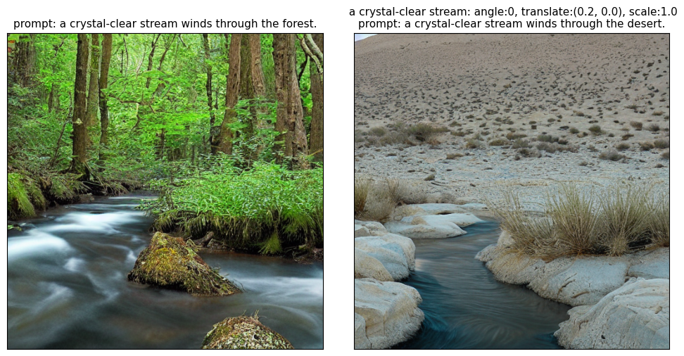

## MFTF: Mask-free Training-free Object Level Layout Control Diffusion Model
## MFTF: Mask-free Training-free Object Level Layout Control Diffusion Model


**Text-to-image generation models have revolutionized content creation, but diffusion-based vision-language models still face challenges in precisely controlling the shape, appearance, and positional placement of objects in generated images using text guidance alone. Existing global image editing models rely on additional masks or images as guidance to achieve layout control, often requiring retraining of the model. While local object-editing models allow modifications to object shapes, they lack the capability to control object positions. To address these limitations, we propose the Mask-free Training-free Object-Level Layout Control Diffusion Model (MFTF), which provides precise control over object positions without requiring additional masks or images. The MFTF model supports both single-object and multi-object positional adjustments, such as translation and rotation, while enabling simultaneous layout control and object semantic editing. The MFTF model employs a parallel denoising process for both the source and target diffusion models. During this process, attention masks are dynamically generated from the cross-attention layers of the source diffusion model and applied to queries from the self-attention layers to isolate objects. These queries, generated in the source diffusion model, are then adjusted according to the layout control parameters and re-injected into the self-attention layers of the target diffusion model. This approach ensures accurate and precise positional control of objects. [[Paper](https://arxiv.org/abs/2412.01284v2)]**

## Model Architechture


## Install
1. clone this repository 
```bash
    git clone https://github.com/syang-genai/MFTF.git
```
2. install package
```bash
    pip install -r requirements.txt
```

## Quick Start
<summary>Example Code</summary>

```Python
import torch
from diffusers import StableDiffusionPipeline

from mftf.utils.utils import prompts_idx, view_images
from mftf.diffusion.diffusion import *
from mftf.attention.attention import *
from mftf.evaluate.evaluate import lpips_metrics, clip_metrics

g_cpu = torch.Generator().manual_seed(42)
device = torch.device('cuda:0') if torch.cuda.is_available() else torch.device('cpu')
ldm_stable = StableDiffusionPipeline.from_pretrained("CompVis/stable-diffusion-v1-4").to(device)
tokenizer = ldm_stable.tokenizer

prompts = [
    "a crystal-clear stream winds through the forest.", 
    "a crystal-clear stream winds through the desert.", 
]

selected_prompts=[["a crystal-clear stream"]]
ref_token_idx=[[]]
prompts_ids =prompts_idx(prompts,tokenizer)
for word in selected_prompts[0][0].split():
    ref_token_idx[0]=ref_token_idx[0]+prompts_ids[0][word]


GUIDANCE_SCALE=7.5
NUM_DIFFUSION_STEPS=30

thres=[0.2]
object_afflines=[{"angle":0,"translate":(0.2,0.0),"scale":1.0,"shear":0}]

layer_idx=list(range(0,60))
step_idx=list(range(0,11))

editor = MFTF(start_step=0, start_layer=0, layer_idx=layer_idx, step_idx=step_idx, total_steps=NUM_DIFFUSION_STEPS, thres=thres, ref_token_idx=ref_token_idx, object_afflines=object_afflines, mask_save_dir="output_masks/stream_desert", model_type="SDXL")
images, x_t = text2image_ldm_stable(ldm_stable, prompts, editor, num_inference_steps=NUM_DIFFUSION_STEPS, guidance_scale=GUIDANCE_SCALE, latent=None, low_resource=False,generator=g_cpu)

view_images(images,prompts,selected_prompts,object_afflines,fixed_width=70,fontsize=11, save_image_path='output_images/stream_desert.png')

print("lpips score",lpips_metrics(images))
print("clip score",clip_metrics(images,prompts))
```
<summary>Example Output</summary>



## Citation
```bibtex
@misc{yang2024mftf,
    title={MFTF: Mask-free Training-free Object Level Layout Control Diffusion Model},
    author={Shan Yang},
    year={2024},
    eprint={2412.01284},
    archivePrefix={arXiv},
    primaryClass={cs.CV}
}
```

## Acknowledgement
the codebase we built upon
- [prompt2prompt](https://github.com/google/prompt-to-prompt)
- [MasaCtrl](https://github.com/TencentARC/MasaCtrl) 
